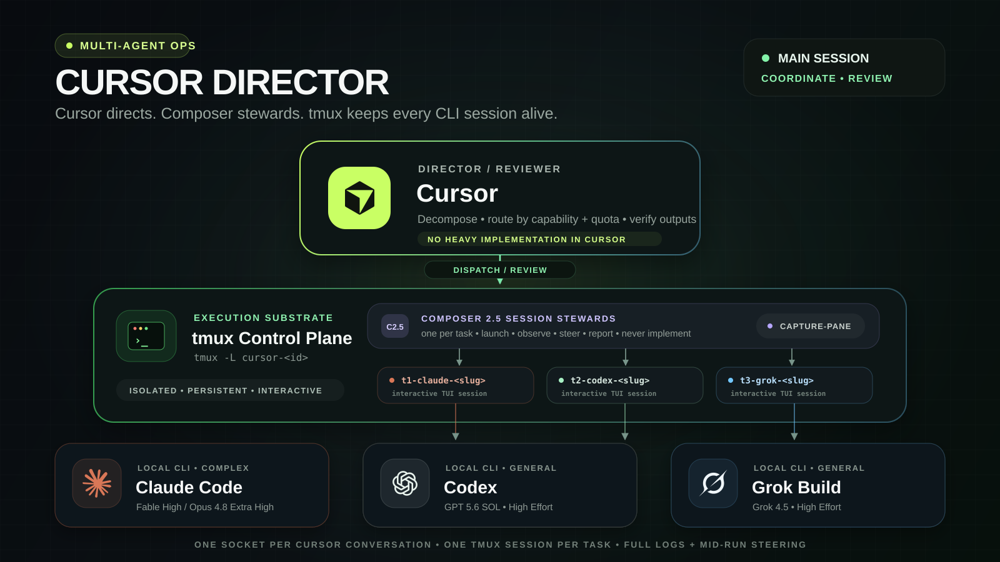

# Cursor Director

Use Cursor Multitask as a lightweight control plane for multiple local CLI coding agents.

Cursor keeps the main session responsive while it understands the request, delegates implementation through background shell commands, monitors subscription limits, and reviews the final result.

## The idea

- **Cursor is the director:** it decomposes work, selects agents, and reviews their output.
- **Claude Code CLI handles complex work:** use Fable with High Effort or Opus 4.8 with Extra High.
- **Codex CLI and Grok CLI handle general execution:** use GPT 5.6 SOL for Codex, or invoke Grok with its verified non-interactive flags.
- **Composer 2.5 handles extremely simple tasks.**
- **Quota-aware routing:** avoid an agent when either its rolling 5-hour or weekly usage reaches 80%.
- **Non-blocking execution:** local CLI agents run in background shells with confirmation skipping enabled, within the scope already authorized by the user.
- **Evidence-based review:** Cursor checks diffs, logs, tests, and artifacts instead of trusting self-reported success.

## Routing summary

| Task type | Agent and configuration |
| --- | --- |
| Extremely simple | Composer 2.5 |
| Complex reasoning, architecture, or debugging | Claude Code CLI: Fable · High Effort, or Opus 4.8 · Extra High |
| Routine or moderately complex implementation | Codex CLI: GPT 5.6 SOL · High Effort, or Grok CLI |

## Use it

Copy the prompt in [prompt.md](./prompt.md) into a new Cursor conversation, then describe the work normally. Cursor remains the single point of coordination while the execution agents work behind it.

## 路由机制教训

旧版 prompt 的路由策略只写了 “Use Claude Code / Codex — GPT 5.6 SOL / Grok Build” 这样的产品名。站在 Cursor 主 agent 的视角，这些名称会被自然映射到 Cursor 内置的 Task 子代理模型（如 claude-fable-5、claude-opus-4-8、gpt-5.6、grok-4.5），导致任务全部消耗 Cursor 自己的 token，而没有使用用户本机安装的 `claude`、`codex`、`grok` 三个 CLI 各自的订阅额度。

因此，只写产品名不够。orchestrator prompt 必须显式规定派工机制：从仓库根目录通过后台 shell 命令启动本机 CLI；同时必须显式禁止使用 Cursor 内置子代理承担实现、调试或分析类工作。
